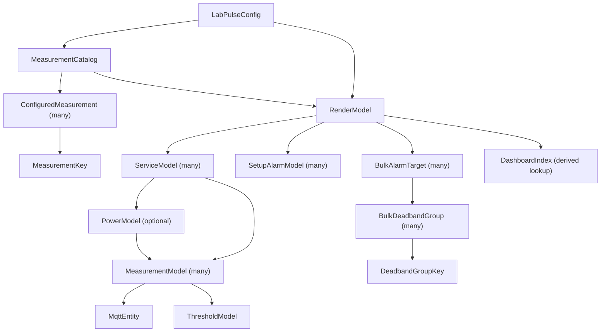

# Home Assistant Render Model Reference

This guide describes the Python dataclasses passed into the Home Assistant
writers. It answers three questions:

1. What does each model contain?
2. Which models contain or reference other models?
3. Which model should a writer use to find a particular value?

The models contain configuration and generated identities. They do not contain
live sensor readings. Home Assistant receives live readings through MQTT.

## Model hierarchy at a glance

The generator builds two parallel structures from the validated LabPulse
configuration:



`MeasurementCatalog` describes physical ownership and logical setup membership.
`RenderModel` describes the Home Assistant entities and settings that will be
written. `DashboardIndex` connects the two structures for dashboard rendering.

## Common access paths

These are the paths most often used by `core_config.py`, `dashboard_writer.py`,
the `dashboard/` renderers, and `alarm_package.py`:

| Needed value | Access path |
| --- | --- |
| All enabled services | `render_model.services` |
| Measurements owned by one service | `service.measurements` |
| MQTT sensor entity ID | `measurement.mqtt_entity.entity_id` |
| Alarm-state helper | `measurement.entities["alarm_state"]` |
| Threshold editor limits | `measurement.threshold` |
| Optional power lifecycle | `service.power` |
| Setup mute helper | `setup.muted_entity` |
| Ordinary alarm measurements | `render_model.alarm_measurements` |
| Bulk alarm destinations | `render_model.bulk_alarm_targets` |
| Measurement by physical key | `dashboard_index.measurements[measurement_key]` |
| Measurements assigned to a setup | `catalog.by_setup[setup_id]` |
| Measurements owned by a service | `catalog.by_service[service_name]` |

## Catalogue models

The catalogue models live in `labpulse_homeassistant/measurement_catalog.py`.
They retain the relationship between the validated config and the render
models without creating Home Assistant entities themselves.

### `MeasurementKey`

The stable physical identity of one measurement.

| Field or property | Contains |
| --- | --- |
| `service_name` | Name of the service that physically owns the measurement |
| `measurement_name` | Name of the measurement within that service |
| `stable_id` | Combined stable ID used by MQTT and Home Assistant |

### `ConfiguredMeasurement`

One canonical measurement from the validated configuration.

| Field | Contains |
| --- | --- |
| `key` | Its `MeasurementKey` |
| `service` | The source `ServiceConfig` |
| `measurement` | The source `MeasurementConfig` |
| `effective_setup_ids` | Ordered IDs of the logical setups using it |

The same `ConfiguredMeasurement` can appear in several catalogue indexes. This
does not duplicate the physical measurement or its Home Assistant entities.

### `MeasurementCatalog`

The complete canonical measurement collection and its lookup indexes.

| Field | Contains |
| --- | --- |
| `measurements` | Every enabled configured measurement once |
| `by_key` | `MeasurementKey` to `ConfiguredMeasurement` lookup |
| `by_setup` | Measurements grouped by logical setup |
| `by_service` | Measurements grouped by physical service |
| `selected_shared_measurements` | Measurements assigned to several setups |

## Measurement render models

These models live in `labpulse_homeassistant/measurement_model.py`.

### `MqttEntity`

The two identities belonging to one MQTT-discovered Home Assistant entity.

| Field | Contains |
| --- | --- |
| `unique_id` | Permanent identity used by Home Assistant's entity registry |
| `entity_id` | Address used by dashboards, templates, and automations |

### `ThresholdModel`

The allowed range and precision of the Home Assistant threshold editors.

| Field | Contains |
| --- | --- |
| `unit` | Display unit such as `bar`, `%`, or `°C` |
| `range_min` | Lowest selectable threshold |
| `range_max` | Highest selectable threshold |
| `step` | Size of one editor adjustment |

### `MeasurementModel`

All generated Home Assistant data for one physical measurement.

| Field or property | Contains |
| --- | --- |
| `service_name` | Physical owner service name |
| `name` | Normalized measurement name |
| `label` | Human-readable display label |
| `subcategory` | Optional dashboard grouping label |
| `device_class` | Native type used for safe bulk-deadband grouping |
| `notification_context` | Setup wording added to notifications and SMS |
| `mqtt_entity` | Raw reading identity as an `MqttEntity` |
| `entities` | Entity role to Home Assistant entity ID lookup |
| `unique_ids` | Template-entity role to stable unique ID lookup |
| `setup_muted_entities` | Setup notification-mute entity IDs |
| `setup_notifications_unmuted_template` | Runtime template allowing delivery while any owning setup is unmuted |
| `threshold` | Its `ThresholdModel` |
| `measurement_id` | Stable helper prefix built from service and measurement names |

Example role lookups:

```python
measurement.entities["alarm_state"]
measurement.entities["minimum_threshold"]
measurement.unique_ids["danger_zone"]
```

## Aggregate render models

These models live in `labpulse_homeassistant/render_model.py`.

### `PowerModel`

The dedicated UPS and external-power lifecycle for one power service.

| Field | Contains |
| --- | --- |
| `voltage` | Voltage `MeasurementModel` |
| `battery_level` | Battery-level `MeasurementModel` |
| `mains_present` | Raw mains-present `MeasurementModel` |
| `config` | Validated `PowerDetectionConfig` |
| `maximum_measurement_age_seconds` | Age at which power readings are stale |
| `entities` | Power-lifecycle role to entity ID lookup |
| `unique_ids` | Power template-entity role to unique ID lookup |

`PowerModel` references measurement models already contained by its
`ServiceModel`; it does not create a second copy of those measurements.

### `ServiceModel`

All generated Home Assistant data for one enabled physical service or sensor
hub.

| Field or property | Contains |
| --- | --- |
| `name` | Service name from config |
| `label` | Human-readable device name |
| `status_entity` | MQTT connection/status `MqttEntity` |
| `entities` | Service-health role to entity ID lookup |
| `unique_ids` | Service template-entity role to unique ID lookup |
| `health_fault_confirm_seconds` | Delay before confirming a service fault |
| `health_recovery_confirm_seconds` | Delay before confirming service recovery |
| `sensor_fault_confirm_seconds` | Delay before confirming stale measurement data |
| `measurements` | Owned `MeasurementModel` objects |
| `power` | Optional `PowerModel` for a dedicated power service |
| `service_id` | Normalized service identifier |

### `SetupAlarmModel`

The notification-mute identity and warning information for one logical setup.

| Field or property | Contains |
| --- | --- |
| `setup_id` | Stable setup identifier |
| `label` | Human-readable setup label |
| `icon` | Dashboard icon |
| `muted_entity` | Setup notification-mute entity ID |
| `measurement_count` | Unique ordinary measurements shown for the setup |
| `shared_measurement_labels` | Shared measurements named in the mute warning |
| `muted_helper_id` | Mute helper key without its domain |
| `shared_measurement_warning` | Confirmation text shown before muting |

It does not contain measurement models. Setup membership remains in
`MeasurementCatalog.by_setup`, preventing setup presentation from becoming a
second source of measurement identity.

### `BulkAlarmTarget` and `BulkDeadbandGroup`

`BulkAlarmTarget` is one destination offered by Group Alarm Settings.

| Field | Contains |
| --- | --- |
| `target_id` | Stable all-measurements or setup identifier |
| `option` | Label shown in the target selector |
| `measurement_keys` | Canonical unique physical measurements |
| `required_danger_percent_entities` | Destination helper IDs |
| `observation_window_seconds_entities` | Destination helper IDs |
| `required_recovery_seconds_entities` | Destination helper IDs |
| `deadband_groups` | Compatible `BulkDeadbandGroup` projections |

Each `BulkDeadbandGroup` contains its `(device_class, exact unit)` key,
display metadata, value/apply helper IDs, target recovery-deadband entities,
and conservative numeric range. A missing device class receives a
measurement-specific fallback key rather than being combined by unit alone.

### `RenderModel`

The top-level Home Assistant render model passed to every writer.

| Field or property | Contains |
| --- | --- |
| `services` | Every enabled `ServiceModel` |
| `setups` | Every non-empty `SetupAlarmModel` |
| `entities` | Global Home Assistant entity IDs |
| `sms_send_topic` | MQTT topic used for SMS requests |
| `bulk_alarm_targets` | Generated `BulkAlarmTarget` objects |
| `bulk_deadband_groups` | Distinct groups from the all-measurements target |
| `bulk_apply_entities` | Every common and typed apply flag |
| `bulk_alarm_target_options` | Labels extracted from the bulk targets |
| `alarm_measurements` | `(ServiceModel, MeasurementModel)` pairs for ordinary alarms |

The containment path for an ordinary measurement is:

```text
RenderModel
  -> ServiceModel
       -> MeasurementModel
            -> MqttEntity
            -> ThresholdModel
```

The containment path for power monitoring is:

```text
RenderModel
  -> ServiceModel
       -> PowerModel
            -> existing MeasurementModel references
```

## Dashboard lookup model

### `DashboardIndex`

`DashboardIndex` lives in `dashboard/primitives.py`. It is derived from a
`RenderModel` and provides direct lookup dictionaries for page renderers.

| Field | Contains |
| --- | --- |
| `services` | Service name to `ServiceModel` |
| `measurements` | `MeasurementKey` to `MeasurementModel` |
| `setups` | Setup ID to `SetupAlarmModel` |

It is not another source of data. Every value points to a model already held by
the `RenderModel`.

## Output path model

### `GeneratorPaths`

`GeneratorPaths` lives in `paths.py` and is separate from the domain hierarchy.
It contains the input config path and every generated Home Assistant output
path, including `configuration.yaml`, the alarm package, dashboard, and
UI-owned YAML files.

## How the writers use the models

### `core_config.py`

Writes `configuration.yaml` and creates the UI-owned automation, script, and
scene files only when they are missing. It does not consume the render model.

### `dashboard_writer.py` and `dashboard/`

Build `DashboardIndex` from `RenderModel` for direct entity lookups. They use
`MeasurementCatalog` for setup/service grouping and the render models for Home
Assistant identities.

### `alarm_package.py`

Expands editable YAML rules with explicit context dictionaries:

| Template key | Python model |
| --- | --- |
| `model` | Top-level `RenderModel` |
| `service` | Current `ServiceModel` |
| `measurement` | Current `MeasurementModel` |
| `setup` | Current `SetupAlarmModel` |
| `power` | Current `PowerModel` |
| `sms` | SMS wording dictionary, not a dataclass |

The template key remains `model` for compatibility with the editable YAML
rules. Python variables should use the more explicit name `render_model` so it
is clear which model is being passed.
