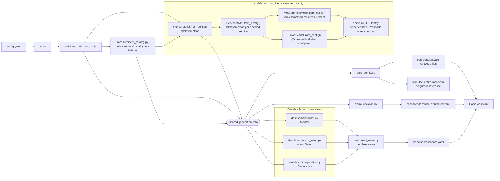

# Home Assistant Generator Package

`labpulse_homeassistant` converts the validated LabPulse config into Home
Assistant core configuration, alarm helpers/automations, a diagnostic entity
map, and the registered YAML-mode LabPulse dashboard.

For the full execution path, render models, placeholders, dashboard behavior,
and alarm state machine, read
[Code internals](../docs/CODE_INTERNALS.md#home-assistant-generator).

## Public entry point

Operators use the wrapper from the live `~/labpulse-ha` directory:

```bash
./generate_homeassistant_config.sh
```

The wrapper handles paths and generated-file permissions before invoking:

```bash
python3 -m labpulse_homeassistant
```

## Generation flow

The CLI prepares the catalogue and asks the model classes to construct
themselves through their `@classmethod from_config()` constructors. The
resulting shared data then feeds three independent writers:



`RenderModel.from_config()` coordinates construction, `ServiceModel.from_config()`
builds each enabled service, and `MeasurementModel.from_config()` derives the
identities belonging to one measurement. Each class returns itself using
`cls(...)`; there is no separate builder module. The writers do not call one
another; `cli.py` passes the completed shared data to each one.

### What is the measurement catalog?

Catalog means a **catalogue of configured measurements**, not stored sensor
values or historical data. `measurement_catalog.py` walks the enabled services in
`config.yaml` and creates exactly one canonical record for each physical
measurement. It then supplies convenient indexes of those same records:

- `by_key`: find one measurement from its service ID and measurement ID;
- `by_service`: group measurements by their physical sensor hub;
- `by_setup`: group measurements by their logical experiment/setup; and
- `selected_shared_measurements`: identify measurements assigned to multiple setups.

For example, a physical measurement such as `pump_room.temperature_0` exists once
in the catalog. If it belongs to two setups, both setup indexes point to that
same measurement record. This is what lets the Monitor and Alarm Setup views repeat
a shared sensor without creating duplicate Home Assistant entities. Diagnostics
uses the service index to show the same measurement under its physical hub.

| File | Simple responsibility |
| --- | --- |
| `cli.py` | Runs the pipeline in order. It does not generate YAML itself. |
| `measurement_catalog.py` | Catalogues every physical measurement once and indexes it by setup and service. |
| `render_model.py` | Declares aggregate render types; `from_config()` derives services, setups, and stable entity IDs. |
| `core_config.py` | Writes core Home Assistant configuration and the diagnostic entity map. |
| `alarm_package.py` | Writes alarm helpers, scripts, sensors, and automations. |
| `dashboard_writer.py` | Assembles the three dashboard pages and writes the dashboard YAML. |

Small supporting modules do not create final files:

| Support | Used for |
| --- | --- |
| `measurement_model.py` | Declares a measurement render model and derives its Home Assistant identities. |
| `paths.py` | Names and locations of generated files. |
| `template_utils.py` | Expanding `[[ ... ]]` placeholders and writing templates. |
| `dashboard/primitives.py` | Card constructors and catalog-to-model lookups. |
| `dashboard/monitor.py` | Monitor page cards. |
| `dashboard/alarm_setup.py` | Alarm Setup page cards. |
| `dashboard/diagnostics.py` | Diagnostics page cards. |
| `templates/` | Editable YAML fragments consumed by the appropriate writer. |

`configuration.yaml` connects the resulting resources: it includes the
generated package directory, registers `labpulse-dashboard.yaml` as the
`labpulse-monitor` YAML dashboard, and includes the three UI-managed YAML
files. `labpulse_entity_map.yaml` is deliberately separate and exists only to
make deterministic entity IDs inspectable.

## Package map

```text
__main__.py
  package entry point

cli.py
  load config, build the canonical catalog/model, orchestrate outputs

measurement_model.py
  MeasurementModel, MqttEntity, ThresholdModel, and their from_config() builders

render_model.py
  RenderModel, ServiceModel, PowerModel, setup/bulk types, and aggregate construction

paths.py
  GeneratorPaths and all generated output locations

core_config.py
  configuration.yaml, entity map, and preservation of UI-owned YAML files

alarm_package.py
  expand alarm seed rules into the generated Home Assistant package

dashboard_writer.py
  compose, serialize, and write the generated dashboard

dashboard/
  monitor.py, alarm_setup.py, and diagnostics.py own their pages;
  primitives.py provides shared card constructors and model lookups

template_utils.py
  recursive LabPulse placeholder expansion and output-file writes

../labpulse_common/sms_templates.yaml
  shared alert, formatting, and subscription-command SMS wording

templates/core/
  outer core/entity-map templates

templates/alarm/
  package shell and editable alarm_logic.yaml seed

templates/dashboard/
  reusable native-card fragments in cards.yaml
```

## Delimiter rule

```text
[[ ... ]]     expanded by LabPulse Python during generation
{{ ... }}     evaluated by Home Assistant at runtime
     evaluated by Home Assistant at runtime
```

Do not replace Home Assistant Jinja delimiters with LabPulse placeholders.

## Dashboard behavior

Normal generation replaces `homeassistant/config/labpulse-dashboard.yaml`.
Home Assistant registers it as the YAML-mode
`labpulse-monitor` dashboard through generated `configuration.yaml`. Layout
changes therefore belong in config, dashboard code, or templates rather than
the Home Assistant UI. There is no storage-backed dashboard fallback, backup,
restore, reset, or entity-synchronization mode.

Monitor and Alarm Setup use explicit logical setup projections; Diagnostics
uses physical service ownership. Alarm Setup packs global tools and configuration
as masonry cards. Each setup configuration row pairs navigation with its mute,
and native hidden subviews retain that mute for each non-empty setup. Dedicated
power monitoring has its own subview. Setup subviews use three native sections: state-hidden
two-across measurement launchers, conditional editable settings, and conditional
live alarm status. Physical Diagnostics uses a compact masonry column per
service for connection, paired health, latest measurements, and optional power
lifecycle state; it contains no ordinary alarm-engine entities. Alarm timing belongs to each measurement. The
generated Bulk Timing script can copy its three timing values to
all ordinary measurements or one setup after dashboard confirmation. Dedicated
power telemetry does not participate in setup grouping.

Monitor nests a native **Active Problems** entity filter in its first masonry
column. It disappears when healthy and surfaces only confirmed service faults,
persistent measurement alarm states, and persistent power states without duplicating
shared setup projections or causing top-level masonry repacking. Individually
muted measurements and measurements under a muted owning setup are filtered out; the
global mute does not hide problems.

## Primary editing points

- Change alarm helpers, zones, transitions, or notifications in
  `templates/alarm/alarm_logic.yaml`.
- Change every user-facing SMS title/message in
  `../labpulse_common/sms_templates.yaml`.
- Change top-level dashboard/view assembly in `dashboard_writer.py`.
- Change one page in its matching `dashboard/monitor.py`, `alarm_setup.py`, or
  `diagnostics.py` renderer.
- Change shared card construction and lookups in `dashboard/primitives.py`.
- Change reusable dashboard fragments in `templates/dashboard/`.
- Change measurement identities in `measurement_model.py`; change aggregate
  types and construction in `render_model.py`.
- Change output assembly only in the owning renderer.

Run `testing/test_homeassistant_entities.py` and
`testing/test_homeassistant_generator.py`, plus
`testing/test_yaml_dashboard.py` and `testing/test_notification_context.py`,
after changes.
