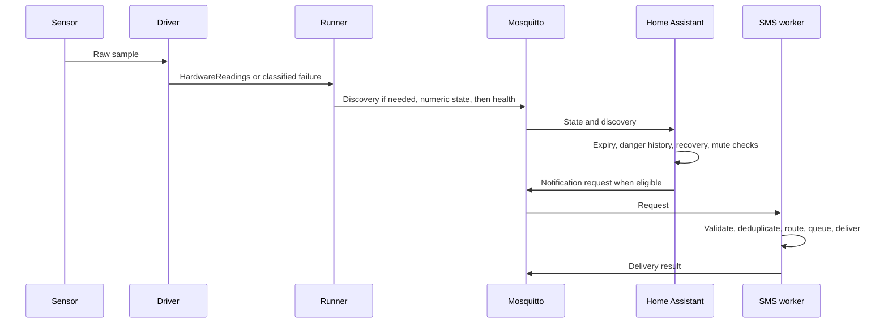

# Architecture

This guide explains where LabPulse's work happens: which program reads a
sensor, which one decides to raise an alarm, and which files you should change
to alter that behaviour.

For a first tour, follow [one pressure reading through the code](MAINTAINING.md#2-follow-one-pressure-reading).
That walkthrough gives concrete values, topics, and source links. Use this
page for the broader design once you've followed that example.

Looking for the code behind a feature? The [package guides](#package-guides)
link to every README under `src/`.

## Find the part you need

| Question | Start here |
|---|---|
| What runs on the Pi, and how do the programs communicate? | [Runtime topology](#runtime-topology) |
| Which files are safe to edit? | [User-owned and generated state](#user-owned-and-generated-state) |
| How do settings reach the workers and dashboard? | [Configuration flow](#configuration-model-and-flow) and [generation](#deployment-generation) |
| Where do sensor connection, retries, and faults belong? | [Hardware process](#hardware-process) and [driver contract](#driver-contract) |
| Who owns alarm and notification decisions? | [Home Assistant](#home-assistant-generation-and-ownership) and [SMS](#sms-process) |
| Where should I start changing code? | [Package guides](#package-guides), then [a complete reading](#follow-a-complete-reading) |

Here, the **host** is the Pi's operating system outside Docker. A **worker**
is a running program assigned to a service or output. **Generation** turns
your settings and LabPulse's templates into the files that Docker and Home
Assistant use; it happens during setup or configuration changes. **Runtime**
means what those programs do afterward while the installation is running.

## Product boundary

LabPulse monitors laboratory infrastructure, produces best-effort alerts, and
can expose explicitly configured non-safety GPIO outputs. It is not a
safety-rated alarm, emergency shutdown system, or protective interlock.
Independent protection remains necessary wherever delayed, missing, or
incorrect telemetry or control could cause harm or loss. See
[User guide and safety boundary](USER_GUIDE.md).

## Runtime topology

```text
physical or simulated sensors
            |
            v
one labpulse-<service> container per enabled service
  hardware CLI -> driver -> runner -> MQTT publisher
            |
            v
        Mosquitto
         |      |
         v      v
Home Assistant  labpulse-sms
  discovery       request validation
  dashboard       routing and deduplication
  alarm state     modem delivery or dry-run logging
  MQTT requests

Home Assistant MQTT switch
            | live ON/OFF command
            v
one labpulse-output-<output> container per enabled output
  MQTT subscriber -> safety policy -> persistent GPIO line request
```

Generated Compose always contains:

- `homeassistant`;
- `mosquitto`;
- `labpulse-sms`;
- one `labpulse-<service-slug>` container for every enabled service;
- one `labpulse-output-<output-slug>` container for every enabled output.

Hardware services do not share a Python process. A blocked or failed device
therefore does not stop another sensor service, and Docker can restart workers
independently.

In real-hardware mode, output workers likewise do not share a process. They own GPIO continuously,
subscribe only to their own command topic, publish verified latch state and
availability, and apply their configured safe state when command authority is
lost. Fake-hardware mode keeps the same workers but stores state only in memory.

## Installed host layout

The pipx-installed package provides the operator command and packaged setup
assets. `labpulse setup` creates or refreshes:

```text
~/labpulse-live/
  config.yaml                         user-owned master configuration
  config.d/                           optional user-owned measurement mappings
  config.resolved.yaml                generated complete real runtime
  config.fake.yaml                    generated complete fake-hardware runtime
  compose.yaml                        generated
  .venv/                              managed host generation environment
  edit_config.sh                      package-managed workflow helper
  generate_compose.sh                 package-managed low-level wrapper
  generate_homeassistant_config.sh    package-managed low-level wrapper
  test_dht11_fault.sh                 package-managed acceptance helper
  test_x1200_faults.sh                package-managed acceptance helper
  backups/                            one rolling copy per backed-up live file
  homeassistant/config/               Home Assistant live state and generated YAML
  mosquitto/                           broker configuration and retained data
  logs/                                Python logs and SMS worker state
```

The managed `.venv` contains host-only generation dependencies and a `.pth`
link to the exact pipx-installed `labpulse` package. Operators do not activate
it. The live wrappers select it automatically.

Runtime Python services use the image selected during generation. A released
installation defaults to:

```text
ghcr.io/lairdgrouplancaster/labpulse:<installed-package-version>
```

## User-owned and generated state

User-owned state includes:

- `~/labpulse-live/config.yaml`;
- `~/labpulse-live/config.d/` physical-measurement fragments;
- Home Assistant accounts, integrations, recorder data, and private storage;
- Mosquitto retained data;
- SMS subscription and processed-request state;
- local modem, operating-system, timezone, watchdog, and hardware setup.

Generated or package-managed state includes:

- `compose.yaml`;
- `config.resolved.yaml`;
- `config.fake.yaml`;
- `homeassistant/config/configuration.yaml`;
- `homeassistant/config/packages/labpulse_generated.yaml`;
- `homeassistant/config/labpulse-dashboard.yaml`;
- copied deployment and test helpers;
- local Mosquitto configuration;
- the managed host `.venv` and its package link.

Generated files are replaceable projections of the live configuration and
package code. They are not independent configuration sources.

Setup updates and guarded configuration tools keep their single rolling
rollback copies in `backups/`, rather than placing timestamped files beside the
active live files. These local rollback copies are separate from the checksummed
state archives created by `labpulse backup`.

## Command surfaces

LabPulse has one public operator CLI and five package-level process entry
points.

### Operator CLI

`src/labpulse/control.py` owns the `labpulse` command:

```text
labpulse setup
labpulse config
labpulse up | down | restart
labpulse ps | logs
labpulse backup | restore
labpulse update | uninstall
labpulse doctor
labpulse usb
labpulse open | firmware | version | help
```

It resolves the live directory, selects the Docker command, delegates setup,
controls Compose, coordinates backup and restore, and exposes diagnostics.
Operator documentation should use this interface.

`labpulse usb` delegates to `src/labpulse/usb.py` for interactive USB serial
identification. It saves confirmed stable device paths in the live master
configuration, with a rolling backup. The operator then applies the mappings
through `labpulse config`.

`src/labpulse/installer.py` locates package data and launches
`deployment/setup_container_fs.sh`. The shell script owns Linux filesystem
scaffolding; it does not own configuration schema or generated Compose logic.

### Package process entry points

Each package with a standalone process keeps command composition at its package
boundary:

```text
package/__main__.py or generator.py -> importable domain modules
```

| Command | CLI responsibility | Domain owner |
|---|---|---|
| `python -m labpulse.hardware` | Compose one hardware worker | `src/labpulse/hardware/` |
| `python -m labpulse.output` | Compose one MQTT-controlled output worker | `src/labpulse/output/` |
| `python -m labpulse.sms` | Load config and compose the SMS worker | subscriber, sender, subscriptions |
| `python -m labpulse.homeassistant` | Generate Home Assistant files | `src/labpulse/homeassistant/` |
| `python -m labpulse.deployment` | Generate deployment files | `src/labpulse/deployment/` |

The entry-point modules own argument parsing and process composition. Importable
domain modules do not inspect `sys.argv` or exit the interpreter.

## Configuration model and flow

### Data to follow in the source

There are two paths through this code. During **generation**, settings become
files. At **runtime**, readings and commands become messages and actions:

```text
Generation:
YAML + fragments -> ConfigDocument -> validated settings
  -> Compose text and HomeAssistantRenderModel -> generated YAML files

Runtime:
device -> HardwareReadings -> runner -> MQTT -> Home Assistant entity state
  -> alarm automation -> SmsRequest -> recipient queue -> DeliveryResult
```

`ConfigDocument` keeps plain resolved YAML data alongside typed settings;
the [common guide](../src/labpulse/common/README.md#follow-a-configuration-load)
explains why both exist. A `DriverDefinition` connects those settings to driver
construction and Docker access. A `HardwareReadings` is one batch of values,
with optional partial faults; the [hardware guide](../src/labpulse/hardware/README.md#follow-one-sample)
follows its publication and failure paths.

The render model contains metadata and expressions, not live readings. Its
nested records and their consumers are mapped in the
[Home Assistant guide](../src/labpulse/homeassistant/README.md#what-the-render-model-contains).
Live entity state and alarm helpers belong to Home Assistant after it loads the
generated YAML. The [SMS guide](../src/labpulse/sms/README.md#follow-an-alert)
then distinguishes request acceptance, queueing and delivery results, including
what survives a restart. Processes exchange serialized messages through MQTT;
they do not pass these Python objects directly to one another.

### Loading settings

`src/labpulse/common/config.py` is the authoritative validated LabPulse configuration loader and
owns the final cross-section validation. Physical and calculated measurement
models live in `common/measurement_config.py`; driver, service, and power models
live in `common/service_config.py`; controlled-output policy lives in
`common/output_config.py`.

The loader returns a `ConfigDocument` containing:

- the resolved source path;
- the ordered master/measurement-fragment source paths;
- the complete raw mapping after `measurements_file` resolution;
- a fully validated `LabPulseConfig`;
- driver options already converted to the selected driver's Pydantic model;
- service measurement defaults already resolved into each measurement.

```text
config.yaml + referenced config.d measurement mappings
  |
  v
common.config.load_config()
  |
  +-- config.resolved.yaml
  |       |
  |       +-- deployment generation
  |       +-- Home Assistant generation
  |       +-- one hardware process per service
  |       +-- one output process per enabled output
  |       +-- SMS worker
  |       \-- diagnostics
```

Only physical service measurement mappings may be external. The loader rejects
general includes, unsafe fragment paths, symlinks, duplicate keys, and services
that specify both inline and external measurements. Runtime containers receive
the standalone generated file and never need access to operator-owned fragments.
Each independent process loads once at startup. Consumers receive typed data and
do not parse source fragments or revalidate driver dictionaries.

Cross-component values are centralized:

- stable IDs: `common/identity.py`;
- MQTT topics and SMS request schema: `common/mqtt_contracts.py`;
- message copy: `common/sms_templates.yaml` through `sms_templates.py`;
- fake-runtime derivation: `common/fake_config.py`;
- single-file replacement: `common/generated_files.py`.

## Deployment generation

`src/labpulse/deployment/compose.py` renders deterministic Compose text from a
validated document and driver resource declarations.

`src/labpulse/deployment/generate.py` owns installation of generated output:

```text
load one ConfigDocument
  +-- render and independently validate config.resolved.yaml
  +-- optionally derive and validate config.fake.yaml
  +-- render Compose in memory
  \-- render Home Assistant into a staging directory
          |
          v
replace managed live files only after every render succeeds
```

A render failure leaves live output unchanged. Installation then replaces each
file individually; a filesystem failure during replacement can leave a mixed
set. This is not an atomic transaction across all files. Setup and `labpulse config` use the
unified path with `--ha-config-dir`.

The shell files `generate_compose.sh` and
`generate_homeassistant_config.sh` are live-directory wrappers around Python
entry points. They are operational conveniences, not generation logic.

### Fake-hardware mode

The source of truth remains `config.yaml` plus any referenced `config.d`
measurement mappings. Generation first creates `config.resolved.yaml`. Fake mode
copies that complete resolved document to `config.fake.yaml` without changing
services, drivers, measurements, outputs or presentation metadata.

Compose mounts the derived file as `/app/config.yaml`. `labpulse config`
detects that runtime mode, regenerates the derived file, validates it, and
keeps the deployment simulated. Compose adds `--simulate` to every sensor and
output worker, removes their physical device requirements, and forces the SMS
worker to dry-run. The workers then use in-memory implementations instead of
constructing the configured hardware drivers.

The service and output container sets are therefore identical in real and fake
modes. Generated Home Assistant files are also identical. Fake mode tests the
complete configuration, container, MQTT and dashboard path without claiming to
test physical transports, wiring or calibration.

## Hardware process

The container command is equivalent to:

```text
python -m labpulse.hardware --config /app/config.yaml --service NAME
```

The flow is:

```text
hardware/__main__.py
  -> load ConfigDocument
  -> select ServiceConfig
  -> registry.get_driver_definition(driver.type)
  -> construct driver from typed configuration
  -> construct HomeAssistantMqttPublisher
  -> HardwareServiceRunner.run_forever()
```

Ownership is strict:

| Concern | Owner |
|---|---|
| Open hardware and normalize raw values | Driver |
| Classify expected hardware failures | Driver |
| Connect, retry, poll, freshness, and cleanup | Runner |
| Service-health transitions | Runner |
| MQTT discovery, state, availability, and status | Publisher |
| Devices, mounts, and privileged requirements | Driver definition |
| Thresholds, alarm transitions, and notifications | Home Assistant |

Drivers do not publish LabPulse output/discovery or manage retry sleeps. The
MQTT JSON driver subscribes to an external input stream as its acquisition transport. The runner does not import
vendor hardware libraries or understand device protocols.

## Driver contract

Every driver extends `HardwareDriver` and implements:

```text
connect() -> None
read() -> HardwareReadings | None
close() -> None
```

The optional `health_status() -> SourceHealth | None` hook defaults to `None`,
meaning successful readings establish source health. Drivers with independent
publisher monitoring can return `WAITING`, `ONLINE`, or `OFFLINE` instead.

`HardwareReadings.values` maps configured measurement names to finite numeric
values. `None` means no complete sample is ready. `HardwareIssue` can accompany
valid measurements when one part of a multi-function device is degraded.

Expected failure classes are:

- `DriverUnavailable`: connection or initialization failed;
- `ConnectionLost`: an established handle must be recreated;
- `TransientReadError`: one read failed but the connection remains usable.

The runner publishes these service states:

```text
disconnected
reconnecting
online
error
awaiting_heartbeat
```

The runner can also publish a `HardwareIssue.code` from a partial sample, such
as `missing_measurements`, while continuing to publish its usable readings.

The MQTT Last Will publishes `offline` if the process loses its broker
connection unexpectedly.

When `health_status()` returns `None` and no valid batch arrives before
`maximum_measurement_age_seconds`, the runner publishes `error`, closes the
driver, and returns to bounded reconnect. It publishes a valid batch before
transitioning to `online`, unless that batch carries a component fault.

With independent health, `WAITING` maps to `awaiting_heartbeat` and `OFFLINE`
to `disconnected`. `ONLINE` can establish online status without a new sample,
but does not clear an existing component fault just because a heartbeat arrived.
Missing samples do not trigger the reading-based reconnect timeout in this
mode. Home Assistant still expires individual measurements and reports
**Needs attention** when required readings are unavailable. Publisher health
therefore does not imply fresh measurement data.

## Driver discovery and container resources

Each public module under `src/labpulse/hardware/drivers/` exports exactly one:

```python
DRIVER_DEFINITION = DriverDefinition(...)
```

The registry imports public modules automatically. The contributor template
lives in `docs/examples`; supporting modules in the production driver package
must begin with `_`.

A `DriverDefinition` contains:

- stable driver ID;
- strict configuration model;
- clearly named driver class;
- container-requirements function;
- default read interval;
- an optional measurement-source binder for transports whose external field
  names differ from LabPulse's stable IDs;
- an optional measurement binder for drivers needing complete per-reading
  configuration, such as GPIO line assignments.

The definition validates configuration once and constructs the driver with the
standard `(service_name, config)` constructor. This makes the driver itself
the hardware-to-runner translation layer; there is no separate adapter type.
The MQTT JSON definition uses its source binder during service validation, so
its driver receives one complete stable-ID-to-source mapping without parsing
service YAML or duplicating measurement IDs in driver options.

Every driver supplies a function returning `ContainerRequirements`, containing
devices, mounts, and a privileged flag. Drivers cannot return arbitrary Compose
YAML.

## MQTT boundary

Hardware publication uses:

```text
Measurement state:  home/sensor/<service>/<measurement>/state
Service status:     home/sensor/<service>/status
Sensor discovery:   homeassistant/sensor/<service>_<measurement>/config
Status discovery:   homeassistant/sensor/<service>_status/config
```

Discovery and service status are retained. Numeric measurement state is not.
Home Assistant discovery contains `expire_after`, so freshness depends on
continued valid publication rather than whether a numeric value changes.

The publisher accepts only names declared in the selected service's
`measurements` list. Unexpected driver keys are ignored.

## Stable identity

Service keys and measurement names define identity across:

- MQTT topics;
- Home Assistant unique IDs and entity IDs;
- alarm helpers and automations;
- dashboard references;
- notification request IDs.

Labels, subcategories, icons, units, and setup projection are presentation
metadata. A measurement may appear in several setup views while remaining one
MQTT entity and one alarm state.

## Home Assistant generation and ownership

The standalone entry point is:

```text
python -m labpulse.homeassistant CONFIG_PATH HA_CONFIG_DIR
```

Its modules have separate roles:

| Module | Responsibility |
|---|---|
| `homeassistant/generator.py` | Arguments, config load, rendering, validation, and atomic file replacement |
| `homeassistant/alarm.py` | Typed render model, threshold metadata, alarm package rendering |
| `homeassistant/templates/` | Final-shaped YAML behavior and layout |

LabPulse Jinja uses `[% ... %]` and `[[ ... ]]`, leaving Home Assistant's
`` and `{{ ... }}` expressions intact in generated YAML.

Home Assistant owns:

- threshold mode and values;
- danger observation percentage and window;
- recovery duration and deadband;
- `Normal` and `Danger` threshold states for available readings;
- Working, Needs attention, and Offline service-status classification;
- required/non-required missing-reading classification and confirmation;
- direct power loss and restoration;
- global, setup, measurement, and power mutes;
- Test mode;
- explicit resend requests for active measurement alerts;
- one central incident dispatcher for persistent notification and SMS request
  creation, suppression, and recovery eligibility.

Python publishes measurements and health facts. It does not decide whether a
measurement is dangerous.

Physical measurement `precision` is sent only as MQTT discovery's
`suggested_display_precision`; the state topic keeps the full numeric value for
alarms and detailed history.

Controlled outputs remain independent workers and MQTT switches. Optional
setup membership changes only dashboard placement: assigned switches appear in
their setup Controls cards, while System Status continues to show every enabled
output.

The notification path is deliberately one-way:

```text
MQTT facts
  -> service / reading / alarm classification
  -> confirmed incident transition
  -> central dispatcher
       -> persistent Home Assistant problem (explicit mutes only)
       -> optional SMS request (explicit mutes)
```

Stable incident and persistent-notification IDs plus restored delivery flags
prevent duplicates after a Home Assistant restart. Service outages suppress
their subordinate reading incidents. A recovery always dismisses the matching
problem, but creates a recovery message only if the opening notification was
actually created. Recovery SMS is paired with an opening SMS request and obeys
the current notification mutes and Test mode. Confirmed Home Assistant
notifications do not depend on the SMS worker. The SMS worker subscribes with a
persistent MQTT session, so distinct failure and recovery requests queued while
it is unavailable are replayed in order after reconnect. The request-ID cache
rejects duplicate QoS 1 deliveries.

## SMS process

The SMS container command is equivalent to:

```text
python -m labpulse.sms --config /app/config.yaml
```

Home Assistant publishes strict JSON requests to:

```text
labpulse/sms/send
```

The worker then:

```text
subscriber
  -> validate SmsRequest
  -> reject duplicate/recent requests
  -> select test or normal recipients
  -> apply subscription choices and cooldown
  -> queue sequential delivery
  -> send through mmcli or log a dry run
  -> publish status and per-request result
```

`subscriber.py` owns MQTT intake and request caching. `sender.py` owns message
formatting, recipient routing, queueing, retries, and ModemManager calls.
`SmsCommandMonitor` and `SubscriptionRegistry` in `sender.py` own inbound
`SUBSCRIBE` and `UNSUBSCRIBE` processing and persistence.

## Backup, restore, and diagnostics

`backup.py` owns the checksummed archive format and safe extraction. Backups
capture user-owned runtime state, not generated files as independent sources.

`control.py` coordinates quiescing services, creating archives, scaffolding a
missing live installation, restoring state, regenerating output, starting the
stack, and attempting rollback if recovery fails.

`doctor.py` is read-only. It checks filesystem state, source/runtime config,
runtime mode, host clock, watchdog, driver resource paths, Docker and Compose,
defined/running services, MQTT, and Home Assistant reachability.

## Source tree ownership

### Package guides

Start with the package overview, then follow the guide for the part you're
working on. Each README maps its local files and points to relevant tests.

| Guide | Open it when you need to understand or change… |
|---|---|
| [Python package overview](../src/labpulse/README.md) | Where host commands and container processes live |
| [Shared configuration and contracts](../src/labpulse/common/README.md) | Settings, stable IDs, MQTT topics, logging, or shared notification text |
| [Deployment generation](../src/labpulse/deployment/README.md) | How configuration becomes Compose and Home Assistant files |
| [Hardware acquisition](../src/labpulse/hardware/README.md) | Reading schedules, retries, service health, and MQTT publication |
| [Hardware drivers](../src/labpulse/hardware/drivers/README.md) | Device protocols, driver registration, or required hardware access |
| [Home Assistant generation](../src/labpulse/homeassistant/README.md) | The data prepared for dashboards and alarms, and how generated files are installed |
| [Home Assistant templates](../src/labpulse/homeassistant/templates/README.md) | Dashboard cards, alarm controls, or automation YAML |
| [Controlled outputs](../src/labpulse/output/README.md) | Switch commands, output state, and safe-state handling |
| [SMS delivery](../src/labpulse/sms/README.md) | Request handling, recipients, modem delivery, or subscriptions |

### Directory map

```text
src/labpulse/
  control.py         public operator CLI and workflow orchestration
  installer.py       package-data lookup and setup launcher
  backup.py          archive creation, validation, extraction, restore
  doctor.py          read-only installation/runtime diagnostics
  usb.py             guided USB serial identification and port assignment
  common/            configuration, IDs, MQTT contracts, shared logging/copy
  deployment/        Compose renderer and staged unified generation
  hardware/          CLI, driver API/registry, runner, parser, MQTT publisher
  output/            controlled-output MQTT subscriber and fail-safe lifecycle
  homeassistant/     CLI, render context, generators, final YAML templates
  sms/               CLI, MQTT subscriber, delivery, subscriptions

deployment/          Linux setup and guarded-edit workflow assets
testing/             executable hardware-free contract/integration tests
firmware/            Arduino library and device examples
hardware/            PCB and enclosure assets
docs/                current operator and contributor documentation
```

New behavior belongs in the package that owns the decision. `common` is only
for contracts and utilities genuinely shared by multiple packages, including
`common/generated_files.py` for atomic single-file replacement.

## Security boundary

By default Mosquitto's anonymous listener is reachable only by containers and
the Pi's `127.0.0.1`; Home Assistant is the user-facing network service. An
optional external listener exists for control-PC measurement publishers. It is
generated only when explicitly enabled and uses a separate host port, TLS
server certificate, password database and topic ACL. The internal listener
remains separate so existing LabPulse containers do not need site credentials.

For each Triton control PC, the production publisher sends non-retained
measurement snapshots only when a new record exists and non-retained
heartbeats from its main loop on a separate topic. Its retained availability
topic has an MQTT Last Will of `offline`. The Pi's MQTT JSON driver requires
both current availability and a newly received heartbeat after each broker
connection. The runner uses that health signal for service status, while Home
Assistant expires old numeric readings independently. A stopped or stalled
publisher becomes one service incident; a quiet logfile leaves the publisher
online without making old measurements current. While awaiting the first
heartbeat, the service shows Needs attention and does not open an outage until
the timeout; an explicit retained `offline` availability reports an outage
promptly. Each service can silence only
its own offline/recovery delivery with `notify_on_service_failure: false`.

Real SMS mode receives `/dev` and D-Bus access. DHT11 currently requires a
privileged hardware container. Other drivers declare narrower device access
where possible. Driver code and runtime images must therefore be trusted.

External publisher deployment still owns the site-specific network boundary:
bind to the intended Pi LAN address, restrict the port to known control-PC
addresses, and verify those rules from another host. Do not expose Mosquitto to
the public internet. Certificate and Windows setup are documented in
[Triton control-PC publisher](TRITON_PUBLISHER.md).

Controlled outputs inherit this trusted-local-broker boundary. Topic
allow-listing, non-retained commands, and clean subscriber sessions prevent
accidental stale replay, but they do not authenticate Home Assistant as the
publisher. The current output feature must not be exposed to untrusted broker
clients.

## Follow a complete reading



A sample, an alarm transition, an accepted request, and a delivered SMS are
separate events. Failure at one boundary is not proof of failure at another.
The [package README hierarchy](../src/labpulse/README.md) follows the local code
ownership and contracts behind this sequence.
